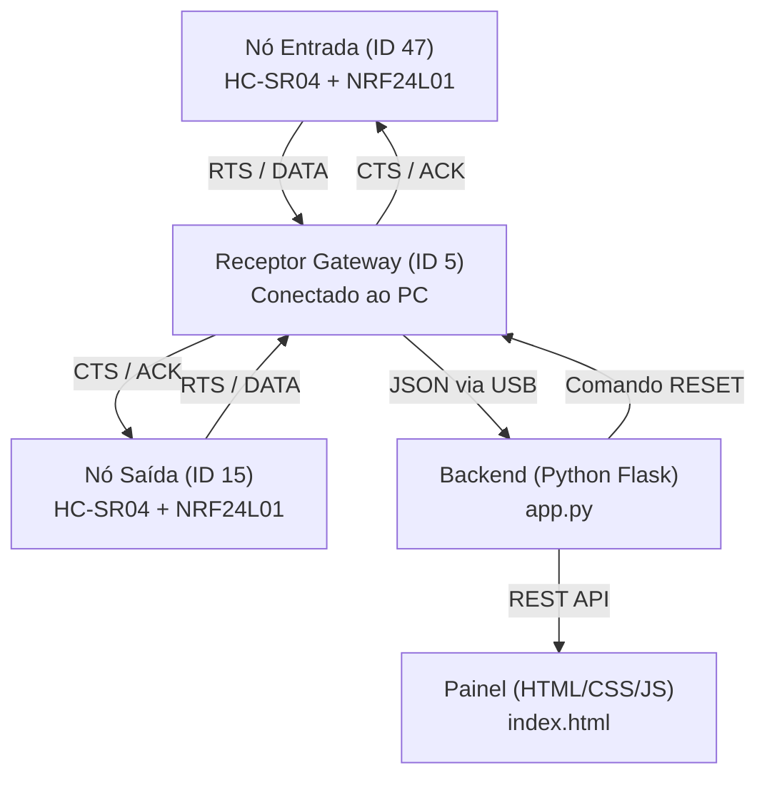

# ReDuino-Counter — Contador de Pessoas RF

Este projeto é um sistema de contagem de pessoas e controle de fluxo usando sensores ultrassônicos e comunicação por rádio NRF24L01. Para evitar que os sinais de rádio batam um no outro e se percam, usamos um handshake simples (RTS ➜ CTS ➜ DATA ➜ ACK) baseado no padrão MACAW. O receptor central (gateway) pega esses dados e joga na porta Serial USB em formato JSON para um backend em Python ([app.py](file:///c:/Users/luisf/Trabalho-T-picos-Especiais-Em-Interfaces-Computacionais/app.py)), que alimenta um painel web em tempo real ([index.html](file:///c:/Users/luisf/Trabalho-T-picos-Especiais-Em-Interfaces-Computacionais/index.html)).

---

## 📸 Painel de Controle (Dashboard)

Aqui está o visual do painel em tempo real:


*(Clique aqui para abrir em tamanho real: [painel.png](file:///c:/Users/luisf/Trabalho-T-picos-Especiais-Em-Interfaces-Computacionais/painel.png))*

---

## 🏗️ Como o sistema funciona

O fluxo dos dados segue esse caminho:
1. **Sensores (Entrada/Saída):** Medem a distância com o sensor ultrassônico. Se alguém passa na frente, o rádio inicia o envio.
2. **Receptor (Gateway):** Recebe o rádio, processa os contadores e joga na porta USB Serial como JSON.
3. **Backend (Python):** Lê a serial, atualiza o status/logs e disponibiliza uma API local.
4. **Frontend (Web):** Consome a API e mostra as contagens, gráficos de ocupação e logs de handshake na tela.



---

## 💻 Divisão do Código (Software)

*   **Backend ([app.py](file:///c:/Users/luisf/Trabalho-T-picos-Especiais-Em-Interfaces-Computacionais/app.py)):**
    *   Usa Flask para a API e rodar o servidor.
    *   Tem uma thread rodando de fundo que fica escutando a USB serial.
    *   Se no `.env` o campo `SERIAL_PORT` estiver como `auto`, ele mesmo testa as portas USB do PC por 3 segundos para achar onde o receptor está plugado.
    *   Endpoints principais:
        *   `GET /api/status`: Retorna o [estado](file:///c:/Users/luisf/Trabalho-T-picos-Especiais-Em-Interfaces-Computacionais/app.py#L65) atual (ocupação, totais, distâncias e status do rádio).
        *   `GET /api/historico`: Últimas 100 leituras armazenadas.
        *   `GET /api/eventos`: Logs individuais de quem entrou ou saiu.
        *   `POST /api/reset`: Zera a contagem local, limpa as filas e avisa o receptor via serial para zerar lá também.

*   **Frontend ([index.html](file:///c:/Users/luisf/Trabalho-T-picos-Especiais-Em-Interfaces-Computacionais/index.html)):**
    *   Uma única página estática feita em HTML, CSS puro e JavaScript básico.
    *   Mostra o fluxo de entrada e saída e o saldo de pessoas no local.
    *   Possui barras de progresso que mostram a proximidade nos sensores em tempo real.
    *   Mostra o gráfico (SVG Sparkline) do histórico recente de ocupação.
    *   Mostra os logs do handshake (RTS ➜ CTS ➜ DATA ➜ ACK) acontecendo ao vivo na lateral.

---

## 📟 Divisão das Placas (Arduino / Firmware)

Os rádios funcionam no **canal 12** com velocidade de **250kbps**.

*   **Nó de Entrada ([entrada_47.ino](file:///c:/Users/luisf/Trabalho-T-picos-Especiais-Em-Interfaces-Computacionais/entrada_47/entrada_47.ino)):**
    *   Componentes: HC-SR04 (Trig no A2, Echo no A3) e NRF24L01 (CE no 7, CSN no 8).
    *   Usa o ID de transmissor **47**.
    *   Antes de mandar a distância medida, envia um pacote do tipo `RTS` e espera o `CTS` do receptor. Se der certo, envia a distância (`DADOS`) e espera o `ACK`. Se falhar em qualquer etapa, ele calcula um tempo aleatório de espera (backoff) antes de tentar de novo, evitando colisões.

*   **Nó de Saída ([saida_15.ino](file:///c:/Users/luisf/Trabalho-T-picos-Especiais-Em-Interfaces-Computacionais/saida_15/saida_15.ino)):**
    *   Componentes e pinagem idênticos ao nó de entrada, mas usa o ID de transmissor **15**.

> ⚠️ **Pegadinha com os IDs das Pastas:**
> Há uma inversão de lógica no código entre as pastas físicas e as variáveis do receptor central ([receptor_5.ino](file:///c:/Users/luisf/Trabalho-T-picos-Especiais-Em-Interfaces-Computacionais/receptor_5/receptor_5.ino)):
> *   O arquivo `entrada_47.ino` define localmente seu ID como 47.
> *   O arquivo `saida_15.ino` define localmente seu ID como 15.
> *   No receptor, a definição está invertida: `#define ID_ENTRADA 15` e `#define ID_SAIDA 47`.
>
> Na prática, isso significa que a placa física que estiver rodando o firmware da pasta **saida_15** atuará como o sensor de **Entrada**, e a placa rodando **entrada_47** atuará como a de **Saída**. O sistema funciona perfeitamente assim, só tenha atenção a esse detalhe ao posicionar fisicamente as placas.

*   **Receptor Gateway ([receptor_5.ino](file:///c:/Users/luisf/Trabalho-T-picos-Especiais-Em-Interfaces-Computacionais/receptor_5/receptor_5.ino)):**
    *   Plugado no USB do computador, fica recebendo os pacotes de rádio.
    *   Ao ouvir o RTS, responde com CTS. Recebe a distância, verifica se está abaixo do limite de [LIMIAR_CM](file:///c:/Users/luisf/Trabalho-T-picos-Especiais-Em-Interfaces-Computacionais/receptor_5/receptor_5.ino#L22) (15 cm) e atualiza o estado correspondente.
    *   Usa variáveis de controle ([presenteEntrada](file:///c:/Users/luisf/Trabalho-T-picos-Especiais-Em-Interfaces-Computacionais/receptor_5/receptor_5.ino#L46) / [presenteSaida](file:///c:/Users/luisf/Trabalho-T-picos-Especiais-Em-Interfaces-Computacionais/receptor_5/receptor_5.ino#L47)) para fazer o debounce. Assim, cada pessoa só é contabilizada uma única vez por passagem física (ao entrar na zona de detecção e só registrar novamente depois de sair dela).
    *   Manda o ACK para a placa transmissora e cospe a string JSON na porta serial para o backend processar.

*   **Teste de Sensor ([teste_sensor.ino](file:///c:/Users/luisf/Trabalho-T-picos-Especiais-Em-Interfaces-Computacionais/teste_sensor/teste_sensor.ino)):**
    *   Programa auxiliar de teste. Não usa rádio, apenas lê as distâncias do HC-SR04 em diferentes pinos e joga na Serial. Útil para verificar se o sensor elétrico está funcionando de forma isolada.

---

## 🚀 Como Executar

### 1. Arduino
1. Instale a biblioteca `RF24` pela IDE do Arduino.
2. Grave o código do [receptor_5.ino](file:///c:/Users/luisf/Trabalho-T-picos-Especiais-Em-Interfaces-Computacionais/receptor_5/receptor_5.ino) na placa que vai ser o gateway USB.
3. Grave o código do [entrada_47.ino](file:///c:/Users/luisf/Trabalho-T-picos-Especiais-Em-Interfaces-Computacionais/entrada_47/entrada_47.ino) e [saida_15.ino](file:///c:/Users/luisf/Trabalho-T-picos-Especiais-Em-Interfaces-Computacionais/saida_15/saida_15.ino) nas respectivas placas sensoras.

### 2. Backend
1. Instale as dependências:
   ```bash
   pip install -r requirements.txt
   ```
2. Copie o arquivo `.env.example` para `.env`:
   ```bash
   cp .env.example .env
   ```
3. No arquivo `.env`, altere o campo `SERIAL_PORT` para a porta USB correta (ex: `COM3` no Windows ou `/dev/ttyUSB0` no Linux), ou deixe `auto` para detecção automática.
4. Execute o servidor:
   ```bash
   python app.py
   ```

### 3. Frontend
Com o servidor rodando, abra o seu navegador e acesse: [http://localhost:3001](http://localhost:3001).
