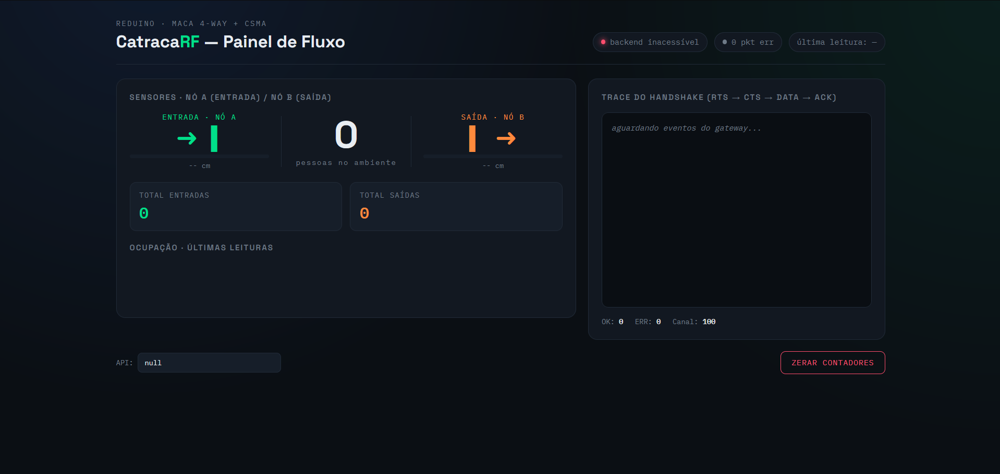

# ReDuino-Counter — Catraca RF

Este projeto consiste em um sistema inteligente de controle de fluxo e contagem de pessoas utilizando sensores ultrassônicos sem fio (via transceptores de rádio NRF24L01) com um protocolo anti-colisão simplificado baseado no padrão MACAW (handshake RTS ➜ CTS ➜ DATA ➜ ACK). Os dados coletados são enviados para um gateway central (receptor), que transmite as informações via interface Serial para um servidor backend Python, exibindo o status de ocupação e histórico de eventos em um painel web interativo.

---

## 📸 Painel de Controle (Dashboard)

Abaixo está o visual do painel de controle em tempo real do sistema:



*Para abrir a imagem em tela cheia, clique aqui: [painel.png](file:///c:/Users/luisf/Trabalho-T-picos-Especiais-Em-Interfaces-Computacionais/painel.png)*

---

## 🏗️ Arquitetura Geral do Sistema

O sistema é dividido em três camadas principais: Hardware/Firmware das placas, Servidor Backend (Python/Flask) e Painel Frontend (HTML/CSS/JS).

```mermaid
graph TD
    %% Nós de Hardware
    subgraph Hardware [Hardware e Firmware]
        no_entrada["Nó Entrada (ID 47)<br/>HC-SR04 + NRF24L01"]
        no_saida["Nó Saída (ID 15)<br/>HC-SR04 + NRF24L01"]
        gateway["Receptor Gateway (ID 5)<br/>Arduino + NRF24L01"]
        
        no_entrada -- "RTS / DATA (RF)" --> gateway
        gateway -- "CTS / ACK (RF)" --> no_entrada
        
        no_saida -- "RTS / DATA (RF)" --> gateway
        gateway -- "CTS / ACK (RF)" --> no_saida
    end

    %% Camada de Software
    subgraph Software [Software (Servidor e Interface)]
        backend["Backend Python (Flask)<br/>app.py"]
        frontend["Dashboard Web<br/>index.html"]
        
        gateway -- "Dados JSON (Serial USB)" --> backend
        backend -- "Comandos (ex: RESET)" --> gateway
        
        backend -- "REST API (HTTP)" --> frontend
        frontend -- "Requisições / Ações" --> backend
    end

    style Hardware fill:#121821,stroke:#212B38,stroke-width:2px,color:#E8EDF2
    style Software fill:#161E29,stroke:#212B38,stroke-width:2px,color:#E8EDF2
    style no_entrada fill:#0A3D2C,stroke:#00E08A,color:#E8EDF2
    style no_saida fill:#3D2410,stroke:#FF8A3D,color:#E8EDF2
    style gateway fill:#212B38,stroke:#2F7CFF,color:#E8EDF2
    style backend fill:#0F172A,stroke:#38BDF8,color:#E8EDF2
    style frontend fill:#1E1B4B,stroke:#818CF8,color:#E8EDF2
```

---

## 📟 Divisão das Placas (Hardware e Firmware)

A comunicação de rádio opera no canal **12** e velocidade de **250kbps**, utilizando pacotes customizados sem CRC de hardware (tratado em software pelo protocolo de enlace).

### 1. Pacote de Dados Comum
Todas as placas utilizam a mesma estrutura de pacote de **6 bytes** para comunicação via rádio:
```cpp
struct Pacote {
  uint8_t tipo;       // 1=RTS, 2=CTS, 3=DADOS, 4=ACK
  uint8_t id;         // ID do nó transmissor
  float distancia;    // Distância medida pelo sensor em cm (se aplicável)
};
```

### 2. Nó de Entrada (`entrada_47`)
*   **Código fonte:** [entrada_47.ino](file:///c:/Users/luisf/Trabalho-T-picos-Especiais-Em-Interfaces-Computacionais/entrada_47/entrada_47.ino)
*   **Hardware:** Arduino Uno/Nano + Transceptor NRF24L01 + Sensor Ultrassônico HC-SR04.
*   **Pinos:**
    *   **HC-SR04:** Trig em `A2`, Echo em `A3`
    *   **NRF24L01:** CE em `D7`, CSN em `D8`
*   **Comportamento:**
    1.  Mede continuamente a distância em centímetros.
    2.  Ao iniciar a transmissão do estado do sensor, envia um pacote **RTS** (Request to Send) identificando-se com seu ID físico.
    3.  Aguardará até 1 segundo pelo pacote **CTS** (Clear to Send) enviado pelo Receptor. Se ocorrer timeout, aplica um tempo de recuo aleatório (backoff) de 300ms a 1000ms antes de tentar novamente (mecanismo CSMA/CA).
    4.  Após receber o CTS, envia o pacote de **DADOS** contendo a medição atual de distância.
    5.  Espera o **ACK** (Acknowledge) de confirmação do receptor. Caso ocorra timeout do ACK, tenta novamente no próximo ciclo.

### 3. Nó de Saída (`saida_15`)
*   **Código fonte:** [saida_15.ino](file:///c:/Users/luisf/Trabalho-T-picos-Especiais-Em-Interfaces-Computacionais/saida_15/saida_15.ino)
*   **Hardware:** Arduino Uno/Nano + Transceptor NRF24L01 + Sensor Ultrassônico HC-SR04.
*   **Pinos:**
    *   **HC-SR04:** Trig em `A2`, Echo em `A3`
    *   **NRF24L01:** CE em `D7`, CSN em `D8`
*   **Comportamento:** Idêntico ao nó de entrada, porém transmite o ID físico correspondente para diferenciação no receptor.

> [!IMPORTANT]
> **Observação sobre a inversão lógica de IDs:**
> No código original do receptor, há uma inversão entre as pastas físicas e as definições de ID do receptor:
> *   O arquivo [entrada_47.ino](file:///c:/Users/luisf/Trabalho-T-picos-Especiais-Em-Interfaces-Computacionais/entrada_47/entrada_47.ino) define localmente `#define ID_ENTRADA 47`.
> *   O arquivo [saida_15.ino](file:///c:/Users/luisf/Trabalho-T-picos-Especiais-Em-Interfaces-Computacionais/saida_15/saida_15.ino) define localmente `#define ID_SAIDA 15`.
> *   No receptor, porém, as definições estão invertidas:
>     ```cpp
>     #define ID_ENTRADA  15
>     #define ID_SAIDA    47
>     ```
> Isso significa que o nó fisicamente programado com o código da pasta `saida_15` (ID 15) será interpretado pelo receptor central como a **Entrada** (Sensor A). E o nó programado com `entrada_47` (ID 47) será interpretado como a **Saída** (Sensor B). O sistema funciona perfeitamente, contanto que essa relação de IDs seja mantida.

### 4. Receptor Gateway (`receptor_5`)
*   **Código fonte:** [receptor_5.ino](file:///c:/Users/luisf/Trabalho-T-picos-Especiais-Em-Interfaces-Computacionais/receptor_5/receptor_5.ino)
*   **Hardware:** Arduino Uno/Nano conectado via cabo USB ao Servidor + Transceptor NRF24L01.
*   **Pinos:** CE em `D7`, CSN em `D8`
*   **Comportamento:**
    1.  Escuta pacotes de rádio continuamente no canal configurado.
    2.  Ao receber um **RTS**, envia um **CTS** de volta para o ID do nó remetente, autorizando a transmissão do pacote de dados.
    3.  Ao receber o pacote contendo a **Distância**, realiza a validação de limite (`LIMIAR_CM` definido em `15.0 cm`):
        *   Caso a distância lida seja menor que o limiar, detecta a presença de uma pessoa.
        *   Utiliza uma lógica de **debounce por estado** (`presenteEntrada` / `presenteSaida`) para garantir que uma pessoa seja contada apenas **uma vez** enquanto estiver na frente do sensor. A contagem incrementa no momento que ela entra no raio de detecção e só reinicia quando a pessoa sair do sensor.
    4.  Responde com um pacote de confirmação **ACK** ao nó sensor.
    5.  Envia imediatamente os dados estruturados em JSON para o servidor através da porta serial (`Serial.println`):
        *   *Mensagem de Status Geral:*
            `{"entradas": 2, "saidas": 1, "ocupacao": 1, "distA": 12.5, "distB": 9999.0, "pktOK": 12, "pktErr": 1}`
        *   *Mensagem de Evento Unitário:*
            `{"evento": "entrada", "total": 2}`
    6.  Monitera a entrada serial para comandos do backend. Ao receber o comando `"RESET"`, reinicia todos os contadores locais e emite o status zerado.

### 5. Placa de Teste Isolada (`teste_sensor`)
*   **Código fonte:** [teste_sensor.ino](file:///c:/Users/luisf/Trabalho-T-picos-Especiais-Em-Interfaces-Computacionais/teste_sensor/teste_sensor.ino)
*   **Comportamento:** Um utilitário de diagnóstico que não usa rádio. Serve para validar o funcionamento elétrico do sensor HC-SR04 em diferentes combinações de pinos analógicos/digitais de forma automática, exibindo os resultados em centímetros no monitor serial.

---

## 💻 Divisão do Software (Serviço e Visualização)

### 1. Servidor Backend (Python Flask)
*   **Código fonte:** [app.py](file:///c:/Users/luisf/Trabalho-T-picos-Especiais-Em-Interfaces-Computacionais/app.py)
*   **Tecnologia:** Python 3 + Flask + PySerial + Flask-CORS + Python-Dotenv.
*   **Funcionamento:**
    *   **Varredura Serial Automatizada:** Se a porta serial estiver definida como `auto` no arquivo `.env`, o backend testa todas as portas disponíveis (`/dev/ttyUSB*`, `/dev/ttyACM*` no Linux ou portas COM no Windows), escutando dados por 3 segundos até detectar qual porta está enviando mensagens no formato JSON `{...}` do receptor.
    *   **Thread Dedicada para Leitura Serial:** Uma thread em segundo plano monitora continuamente a porta serial USB. Quando dados válidos em JSON são recebidos, eles atualizam o dicionário global `estado` e as filas de histórico (`historico` e `eventos`, usando estruturas `deque` com limites máximos de 100 e 200 itens).
    *   **Endpoints HTTP expostos:**
        *   `GET /`: Serve a interface estática do frontend ([index.html](file:///c:/Users/luisf/Trabalho-T-picos-Especiais-Em-Interfaces-Computacionais/index.html)).
        *   `GET /api/status`: Retorna o estado atual da catraca (ocupação, número de entradas, saídas, última distância lida pelo Sensor A e B, status de conexão serial, pacotes OK/com erro).
        *   `GET /api/historico`: Lista das últimas 100 leituras completas salvas em cache na memória (ordenadas do mais recente ao mais antigo).
        *   `GET /api/eventos`: Logs pontuais das passagens de fluxo individuais.
        *   `POST /api/reset`: Envia a string `"RESET"` via serial para zerar o hardware e esvazia as filas do histórico local.
        *   `GET /api/health`: Endpoint utilitário para checar a saúde do servidor, porta serial em uso e o status da conexão física com o receptor.

### 2. Frontend Dashboard (Interface Web)
*   **Código fonte:** [index.html](file:///c:/Users/luisf/Trabalho-T-picos-Especiais-Em-Interfaces-Computacionais/index.html)
*   **Tecnologia:** HTML5 semântico, Vanilla CSS moderno (Dark Mode com gradientes sutis em azul e verde, fontes estilizadas do Google Fonts *Space Grotesk* e *IBM Plex Mono*), Vanilla JavaScript.
*   **Recursos visuais do painel:**
    *   **Top Bar de Informação:** Exibe o status da porta serial do gateway (online/offline), taxa de erros de pacotes rádio e hora da última leitura.
    *   **Seção de Sensores Dinâmica:** Mostra a distância em centímetros de ambos os sensores em tempo real. Uma barra de progresso horizontal reflete o nível de proximidade do objeto em relação ao limiar de detecção. Setas direcionais acendem e pulsam momentaneamente ao registrar um evento de passagem.
    *   **Métrica de Ocupação:** Destaque centralizado da quantidade estimada de pessoas atualmente dentro do ambiente.
    *   **Gráfico de Linha (Sparkline):** Gráfico SVG leve renderizado sob demanda para mostrar a variação histórica do nível de ocupação do recinto.
    *   **Trace do Protocolo (Logs de Enlace):** Lista interativa à direita simulando a recepção sequencial em tempo real dos pacotes de handshake de rádio: `RTS → CTS → DATA → ACK` de cada fluxo.
    *   **Ação de Reset:** Botão destacado no rodapé que dispara uma requisição POST ao endpoint de reset do backend.
    *   **Configuração de Host:** Input interativo para ajustar a URL base da API HTTP, permitindo a visualização e monitoramento a partir de outros dispositivos conectados na mesma rede.

---

## 🚀 Como Configurar e Executar o Projeto

### Passo 1: Carregar os Firmwares
1.  Instale a biblioteca `RF24` na sua IDE do Arduino.
2.  Carregue o firmware [receptor_5.ino](file:///c:/Users/luisf/Trabalho-T-picos-Especiais-Em-Interfaces-Computacionais/receptor_5/receptor_5.ino) na placa que funcionará como gateway conectada ao seu computador.
3.  Carregue o firmware [entrada_47.ino](file:///c:/Users/luisf/Trabalho-T-picos-Especiais-Em-Interfaces-Computacionais/entrada_47/entrada_47.ino) no sensor posicionado na barreira física de entrada.
4.  Carregue o firmware [saida_15.ino](file:///c:/Users/luisf/Trabalho-T-picos-Especiais-Em-Interfaces-Computacionais/saida_15/saida_15.ino) no sensor posicionado na barreira física de saída.

### Passo 2: Configurar o Ambiente do Backend
1.  Com o terminal aberto na raiz do projeto, instale as dependências:
    ```bash
    pip install -r requirements.txt
    ```
2.  Copie o arquivo de exemplo de ambiente `.env.example` para `.env`:
    ```bash
    cp .env.example .env
    ```
3.  Edite o arquivo `.env` para ajustar os parâmetros de execução. Se desejar que a porta USB seja detectada automaticamente, configure `SERIAL_PORT` para `auto`:
    ```ini
    SERIAL_PORT=auto
    BAUD_RATE=115200
    PORT=3001
    FRONTEND_URL=http://localhost:3001
    ```

### Passo 3: Executar o Servidor
Execute o script Python principal:
```bash
python app.py
```
O console exibirá as mensagens do detector de porta USB e iniciará o servidor na porta definida (por padrão, `http://localhost:3001`).

### Passo 4: Acessar a Interface
Abra o seu navegador e acesse a URL: [http://localhost:3001](http://localhost:3001). A interface irá se conectar automaticamente à API local e iniciará a coleta em tempo real a cada 1.2 segundos.
